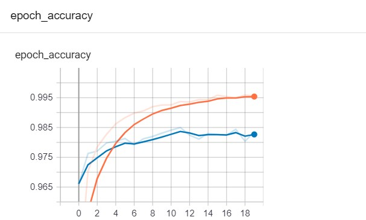
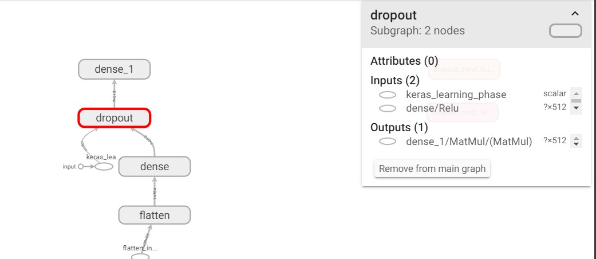
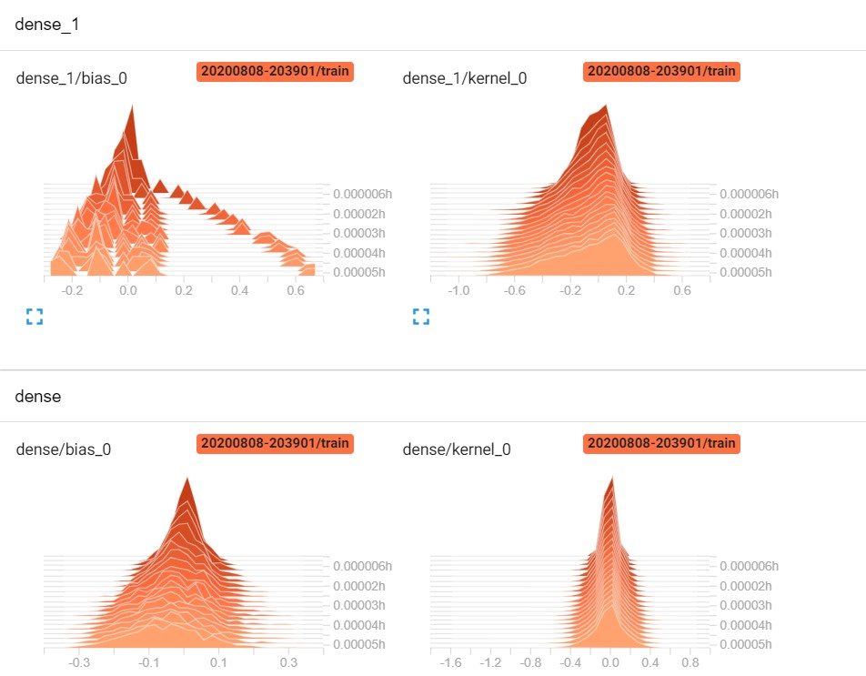

# Tensorboard-Tutorial
It gives the Visualization of whole model- Graphs, Computational graphs, Histograms , Distributions and Metric Evaluation too.
<h2><strong>Accuracy</strong></h2>

<ul><li>orange- training</li>
  <li>blue- validation</li></ul>
<h2><strong>Graph of the Model</strong></h2>

<h2><strong>Distribution of the weights </strong></h2>

  
